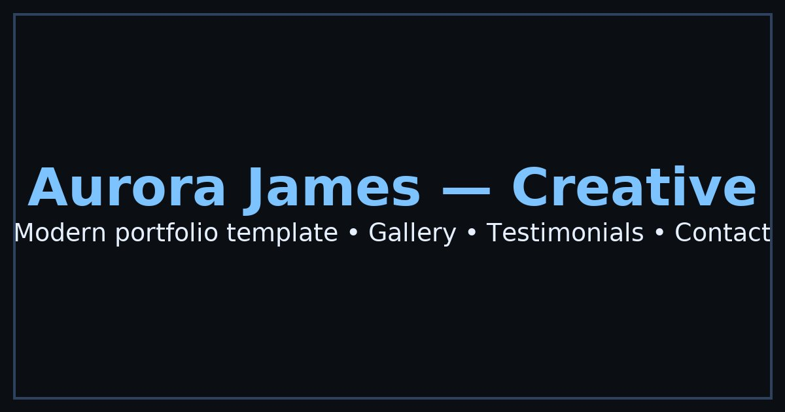

# Aurora James — Creative Portfolio Template

A modern, accessible, and responsive one-page portfolio template built with vanilla HTML, CSS, and JavaScript. Perfect for creative professionals looking to showcase their work with a polished, professional presentation.



## ✨ Features

### 🎨 Design & Layout
- **Dark/Light Theme Toggle** - Persistent theme preference with localStorage
- **Mobile-First Responsive Design** - Optimized for all screen sizes (360px+)
- **Modern UI/UX** - Clean, professional design with smooth animations
- **Accessible Design** - WCAG 2.1 AA compliant with proper semantic markup

### 📱 Sections
- **Sticky Navigation** - Logo and navigation links with active highlighting
- **Hero Section** - Compelling headline with dual call-to-action buttons
- **About Section** - Bio with achievement statistics (Years, Clients, Projects)
- **Services Section** - 4 service cards with icons and descriptions
- **Work Gallery** - 6 project items with modal lightbox functionality
- **Testimonials** - 3 client testimonials with names and roles
- **Contact Form** - Functional form with validation and Formspree integration
- **Footer** - Quick links and social media placeholders

### 🔧 Functionality
- **Smooth Scrolling** - Navigation with smooth scroll behavior
- **Intersection Observer** - Active navigation highlighting
- **Modal Lightbox** - Accessible work gallery with keyboard navigation
- **Form Validation** - Client-side validation with error messages
- **Theme Persistence** - Remembers user's theme preference
- **Performance Optimized** - Lazy loading, optimized images, minimal bundle size

### 🌐 Technical Features
- **SEO Optimized** - Meta tags, Open Graph, Twitter Cards, sitemap.xml
- **PWA Ready** - Service worker, manifest.json, offline functionality
- **Performance** - Lighthouse targets: Performance ≥90, Accessibility ≥95, Best Practices ≥90, SEO ≥90
- **Security** - Content Security Policy, security headers
- **Deployment Ready** - Netlify and Vercel configuration files

## 🚀 Quick Start

### Prerequisites
- A modern web browser
- Basic knowledge of HTML, CSS, and JavaScript
- A Formspree account (for contact form functionality)

### Installation

1. **Clone or Download**
   ```bash
   git clone https://github.com/yourusername/aurora-james-portfolio.git
   cd aurora-james-portfolio
   ```

2. **Customize Content**
   - Edit `index.html` to update personal information
   - Modify `styles.css` to adjust colors and styling
   - Update `script.js` for custom functionality

3. **Setup Contact Form**
   - Sign up at [Formspree](https://formspree.io)
   - Replace `your-form-id` in the form's `data-action` attribute
   - Test the form functionality

4. **Run Locally**
   ```bash
   # Using Python 3
   python -m http.server 8000
   
   # Using Node.js
   npx serve .
   
   # Using PHP
   php -S localhost:8000
   ```

5. **Open Browser**
   Navigate to `http://localhost:8000`

## 🎨 Customization

### Colors & Theme
The template uses CSS custom properties for easy theming. Edit the variables in `styles.css`:

```css
:root {
  --bg: #0b0f14;           /* Background color */
  --panel: #111826;        /* Panel/card backgrounds */
  --text: #e6f0ff;        /* Primary text color */
  --muted: #9fb3d1;       /* Secondary/muted text */
  --border: #1e2a3b;      /* Border color */
  --accent: #7cc3ff;      /* Accent/primary color */
  --accent-hover: #5aa3e0; /* Accent hover state */
}
```

### Content Updates

#### Personal Information
Update the following in `index.html`:
- Name and tagline in the header and footer
- Hero section title and subtitle
- About section bio and statistics
- Contact information (email, phone)
- Social media links

#### Work Portfolio
Modify the work items in `index.html` and corresponding data in `script.js`:
```javascript
const workData = {
  1: {
    title: "Your Project Title",
    category: "Category",
    image: "path/to/image.jpg",
    description: "Project description..."
  }
  // Add more projects...
};
```

#### Services
Update the services section with your offerings:
- Service titles and descriptions
- Custom icons (SVG format recommended)
- Pricing or additional details

#### Testimonials
Replace the sample testimonials with real client feedback:
- Client names and roles
- Testimonial content
- Company information

### Images
- **Favicon**: Replace `favicon.ico` with your logo (16x16, 32x32)
- **OG Image**: Update `og-image.jpg` for social media sharing (1200x630px)
- **Work Images**: Use high-quality images (800x600px recommended)
- **Optimize**: Compress images for web (use tools like TinyPNG)

## 📦 Deployment

### Netlify Deployment
1. Push your code to GitHub
2. Connect your repository to Netlify
3. Deploy automatically with the included `netlify.toml`

### Vercel Deployment
1. Install Vercel CLI: `npm i -g vercel`
2. Run: `vercel` in your project directory
3. Follow the prompts

### Manual Deployment
Upload all files to your web hosting provider:
- `index.html`
- `styles.css`
- `script.js`
- `manifest.json`
- `sw.js`
- `robots.txt`
- `sitemap.xml`
- Image files

## 🔧 Configuration

### Formspree Setup
1. Create account at [Formspree](https://formspree.io)
2. Create a new form
3. Copy the form endpoint
4. Update the form's `data-action` attribute in `index.html`

### SEO Optimization
- Update meta descriptions and titles
- Add your domain to `sitemap.xml`
- Update `robots.txt` with your domain
- Add Google Analytics (optional)

### Performance Optimization
- Optimize images (WebP format recommended)
- Minify CSS and JavaScript for production
- Enable gzip compression on your server
- Use a CDN for static assets

## 📊 Performance Targets

The template is optimized to achieve the following Lighthouse scores:

- **Performance**: ≥90
- **Accessibility**: ≥95
- **Best Practices**: ≥90
- **SEO**: ≥90

## 🛠️ Browser Support

- Chrome 60+
- Firefox 55+
- Safari 12+
- Edge 79+
- Mobile browsers (iOS Safari, Chrome Mobile)

## 📝 License

This template is available under the MIT License. Feel free to use it for personal and commercial projects.

## 🤝 Contributing

Contributions are welcome! Please feel free to submit a Pull Request.

## 📞 Support

If you have any questions or need help customizing the template:

1. Check the documentation above
2. Review the code comments
3. Open an issue on GitHub
4. Contact: hello@aurorajames.com

## 🔄 Updates

Stay updated with the latest features and improvements:

1. Star this repository
2. Watch for updates
3. Follow the changelog

---

**Built with ❤️ by Aurora James**

*Modern, accessible, and professional portfolio template for creative professionals.*


---

## Polish Notes (Assistant)
- Added mobile hamburger menu with accessible `aria-expanded` and Escape to close.
- Ensured `#navLinks` collapses on small screens and expands on desktop.
- Replaced broken `og-image.jpg` with an optimized 1200×630 image (Twitter/OG friendly).
- Verified images use `loading="lazy"` and `decoding="async"`; scripts deferred.
- Kept contrast and `:focus-visible` outlines for WCAG AA.
